# MERN Stack

Welcome to the MERN Stack! This guide will help you set up a MERN stack application step-by-step.

## Prerequisites

- **Node.js and npm**: Ensure that Node.js and npm (Node Package Manager) are installed on your machine. These are essential for running JavaScript on the server and managing dependencies.
- **Basic knowledge of JavaScript**: Familiarity with JavaScript syntax and concepts will help you follow along more easily.

## Folder Structure

We'll start by organizing our project into two main folders:

1. **`frontend`**: This folder will contain all the files related to the client-side of our application, which is built using React.js.
2. **`backend`**: This folder will contain the server-side code, where we'll handle data processing, business logic, and communication with the database.

## Day 1: Backend Setup

### Introduction

The backend of a MERN application is where the core logic resides. It handles tasks such as processing requests, interacting with databases, and sending responses. We'll use **Express.js**, a fast and minimalist web framework for Node.js, to build our server.

### Step 1: Navigate to the Backend Folder

Start by navigating to the `backend` folder where we'll set up our server:

```bash
cd backend
```

### Step 2: Initialize a Node.js Project

We need to initialize our backend project by creating a `package.json` file. This file keeps track of our project's metadata and dependencies.

```bash
npm init -y
```

### Step 3: Install Express.js

**Express.js** is a popular framework for building web servers in Node.js. It simplifies the process of handling HTTP requests, routing, and middleware.

```bash
npm install express
```

### Step 4: Create the Server

Now, create a file named `index.js`. This file will contain the code to set up a basic Express server. The server listens for incoming requests and responds with a simple message.

```js
const express = require("express");
const app = express();

app.get("/", (req, res) => {
  res.send("Hello World");
});

const PORT = 3000;

app.listen(PORT, () => {
  console.log(`Server is running on port ${PORT}`);
});
```

### Step 5: Run the Server

To start the server, we'll use **Nodemon**, a tool that automatically restarts the server whenever you make changes to your code. This makes the development process more efficient.

```bash
nodemon index.js
```

If you haven't installed `nodemon`, you can do so globally with:

```bash
npm install -g nodemon
```

Open your browser and navigate to `http://localhost:3000` to see the "Hello World" message from your server.

## Day 2: Router in Express.js

### Introduction

Routing is a critical aspect of any web application. It determines how an application responds to different HTTP requests (e.g., GET, POST) for specific endpoints (URLs). **Express.js** provides a powerful and flexible routing system that helps you manage the different parts of your application more effectively.

### Creating and Organizing Routes

Routes help you define specific endpoints in your application and map them to the corresponding logic. This makes your code more modular and easier to maintain.

#### Step 1: Create Router Folder and File

To keep our routes organized, we'll create a new folder named `router` inside the `backend` folder. Within this folder, create a file named `auth-router.js`. This file will handle the routes related to authentication.

Add the following code to `auth-router.js`:

```js
const express = require("express");
const router = express.Router();

// Basic route setup using Router
router.route("/").get((req, res) => {
  res.send("Hello World using Router");
});

module.exports = router;
```

#### Step 2: Update `index.js`

Now, we'll modify `index.js` to include our new router. This allows us to separate concerns and keep our main server file clean.

```js
const express = require("express");
const app = express();

const router = require("./router/auth-router");
app.use("/api/auth", router);

app.get("/", (req, res) => {
  res.send("Hello World");
});

const PORT = 3000;

app.listen(PORT, () => {
  console.log(`Server is running on port ${PORT}`);
});
```

With these changes:

- Visiting `http://localhost:3000` will still display "Hello World".
- Visiting `http://localhost:3000/api/auth` will display "Hello World using Router", showcasing our new route setup.

## Day 3: Controllers in Express.js

### Introduction

Controllers are a key part of the **MVC (Model-View-Controller)** design pattern. They are responsible for processing incoming requests, interacting with the data layer (models), and sending responses back to the client. By using controllers, we can keep our application logic organized and modular.

### Step 1: Create Controllers Folder and File

In the `backend` folder, create a new folder named `controllers` and a file named `auth-controller.js`. This file will contain the logic for handling authentication-related requests.

Add the following code to `auth-controller.js`:

```js
const home = async (req, res) => {
  try {
    res.send("Welcome to the home page using controllers");
  } catch (error) {
    console.log(error);
  }
};

const register = async (req, res) => {
  try {
    res.send("Welcome to the register page using controller");
  } catch (error) {
    console.log(error);
  }
};

module.exports = { home, register };
```

### Step 2: Update `auth-router.js`

Next, update the `auth-router.js` file to use the new controller functions. This will link the routes to the appropriate logic in the controllers.

```js
const express = require("express");
const router = express.Router();
const { home, register } = require("../controllers/auth-controller");

router.route("/").get(home);
router.route("/register").post(register);

module.exports = router;
```

### Final Check

- Visit `http://localhost:3000` to see the basic "Hello World" message.
- Visit `http://localhost:3000/api/auth` to see the "Hello World using Router" message.
- Visit `http://localhost:3000/api/auth/register` to see the "Welcome to the register page using controller" message.

## Day 4: Middlewares and Testing API using Postman

### Introduction

Middlewares are functions that execute during the lifecycle of a request to the Express server. They have access to the request object, response object, and the next middleware function in the application’s request-response cycle. Middlewares are crucial for adding functionality such as parsing request bodies, handling authentication, or logging requests.

### Step 1: Add JSON Middleware

To test API requests, we'll need to parse incoming JSON data. Express provides a built-in middleware `express.json()` that parses incoming requests with JSON payloads. It should be added at the beginning of your middleware stack to ensure it is available for all subsequent route handlers.

```js
const express = require("express");
const app = express();

const router = require("./router/auth-router");

// Middleware
app.use(express.json());

app.use("/api/auth", router);

app.get("/", (req, res) => {
  res.send("Hello World");
});

const PORT = 3000;

app.listen(PORT, () => {
  console.log(`Server is running on port ${PORT}`);
});
```

### Step 2: Update the Register Route

Ensure the register route is set to handle POST requests, as this is the standard for creating resources or submitting data.

```js
const express = require("express");
const router = express.Router();
const { home, register } = require("../controllers/auth-controller");

router.route("/").get(home);
router.route("/register").post(register);

module.exports = router;
```

### Step 3: Handle the Register Logic

Modify the `register` function in `auth-controller.js` to handle and respond with the JSON data:

```js
const home = async (req, res) => {
  try {
    res.send("Welcome to the home page using controller");
  } catch (error) {
    console.log(error);
  }
};

const register = async (req, res) => {
  try {
    console.log(req.body); // Log the incoming request body
    res.json({ message: "User registered successfully", data: req.body });
  } catch (error) {
    console.log(error);
  }
};

module.exports = { home, register };
```

### Step 4: Test with Postman

To test the API with Postman:

1. Set the request type to `POST`.
2. Enter `http://localhost:3000/api/auth/register` in the URL.
3. In the Headers tab, add `Content-Type` as the key and `application/json` as the value.
4. In the Body tab, select `raw` and `JSON` from the dropdown, then enter the following JSON:

```json
{
  "email": "amankrsinha07@gmail.com",
  "password": 12334
}
```

5. Click `Send` to make the request. You should see the response containing the JSON data you sent.

- For visual reference, check the screenshots provided:

- 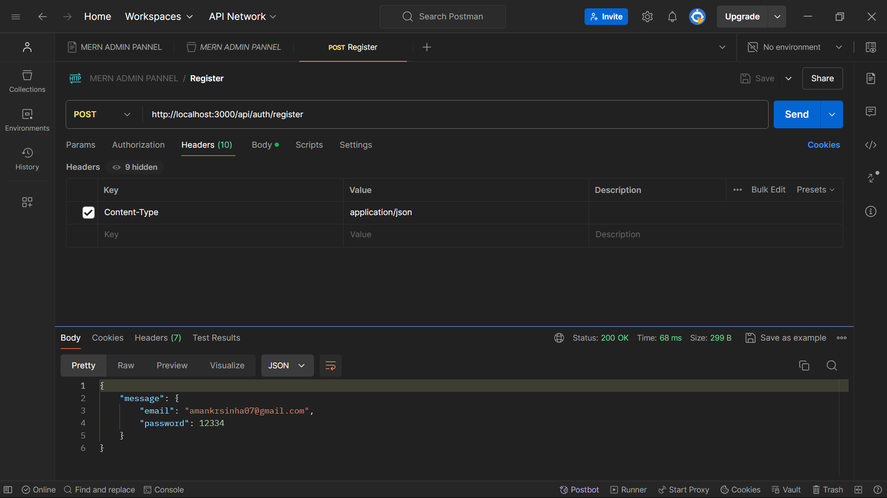
- 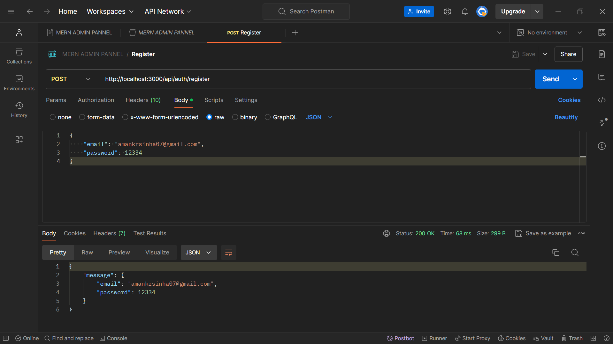

## Day 4: Connecting Backend with MongoDB

In this section, we'll connect our backend to MongoDB, a NoSQL database that stores data in flexible, JSON-like documents. We will use **Mongoose**, an ODM (Object Data Modeling) library, to interact with MongoDB in a more structured and efficient way.

### Step 1: Install Required Packages

First, install the necessary packages for MongoDB connection and environment variable management:

```bash
npm install mongodb mongoose dotenv
```

### Step 2: Set Up MongoDB Atlas

To use MongoDB in a cloud environment, follow these steps to set up MongoDB Atlas:

1. **Create a MongoDB Atlas Account:**

   - Visit [MongoDB Atlas](https://www.mongodb.com/cloud/atlas/register) and log in or sign up for an account.

2. **Create a New Project:**

   - After logging in, create a new project in MongoDB Atlas.

   - 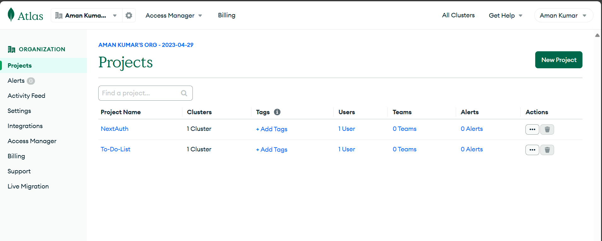
   - 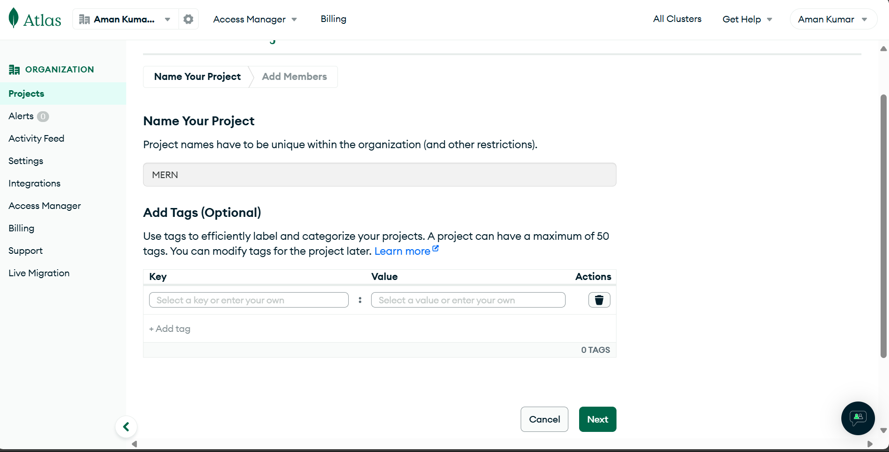
   - 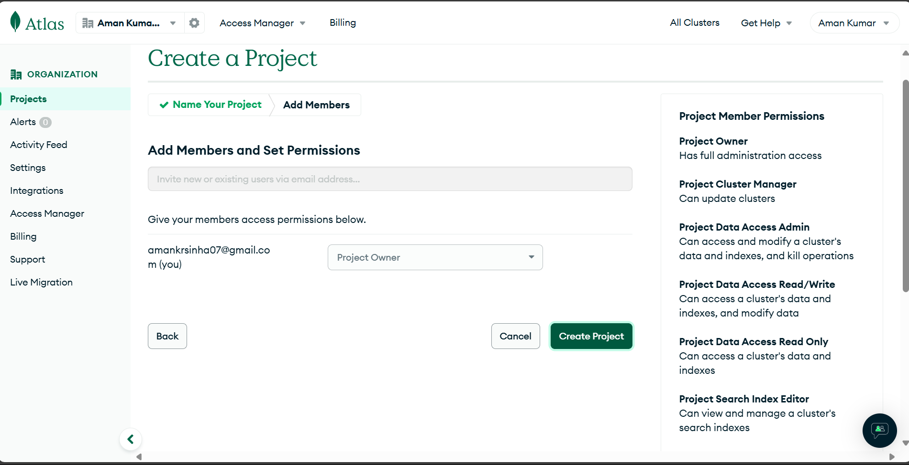

3. **Configure Network Access:**

   - In the security section, open the **Network Access** tab.
   - Add your current IP address to allow access from your machine.
   - If you want to access your database from any computer, then add this IP also `0.0.0.0/0`

   - 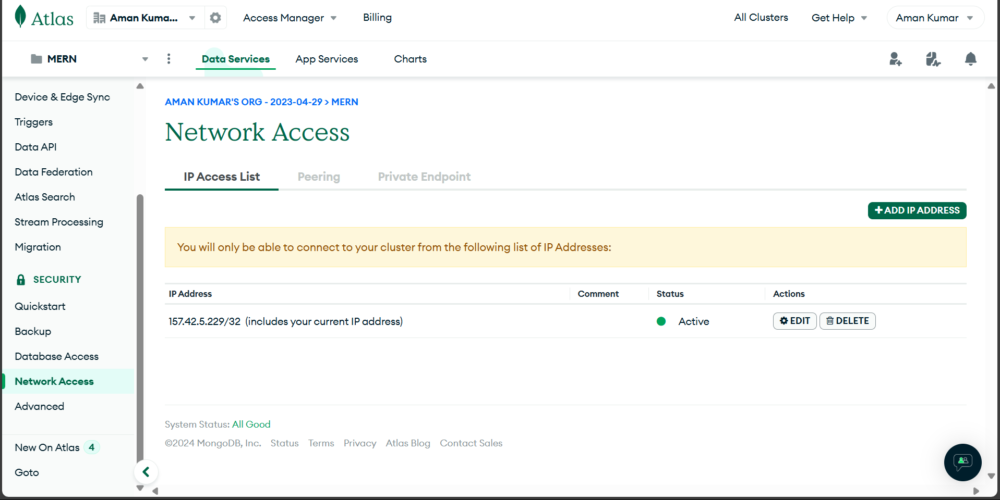

4. **Create a Database User:**

   - In the **Database Access** tab, add a new user with `Read and Write` permissions.

   - 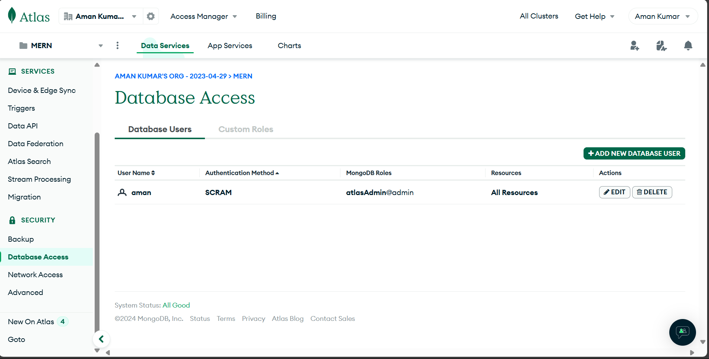

5. **Create a Cluster:**

   - Go to the **Deployment** section and create a new cluster. Choose your preferred configuration.

   - 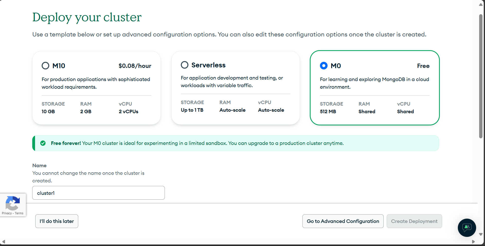

6. **Connect to Your Cluster:**

   - After the cluster is created, click on the **Connect** button.

   - 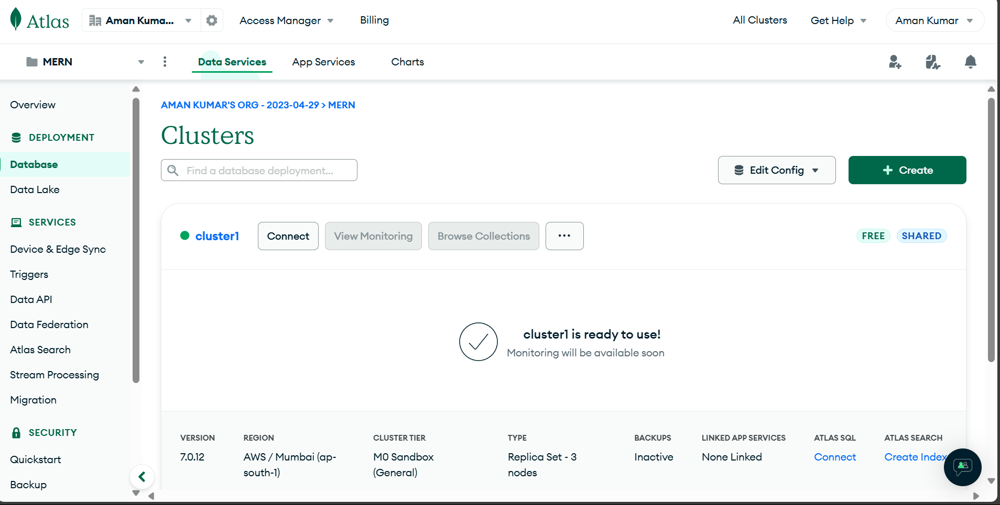

   - Choose a connection method

   - 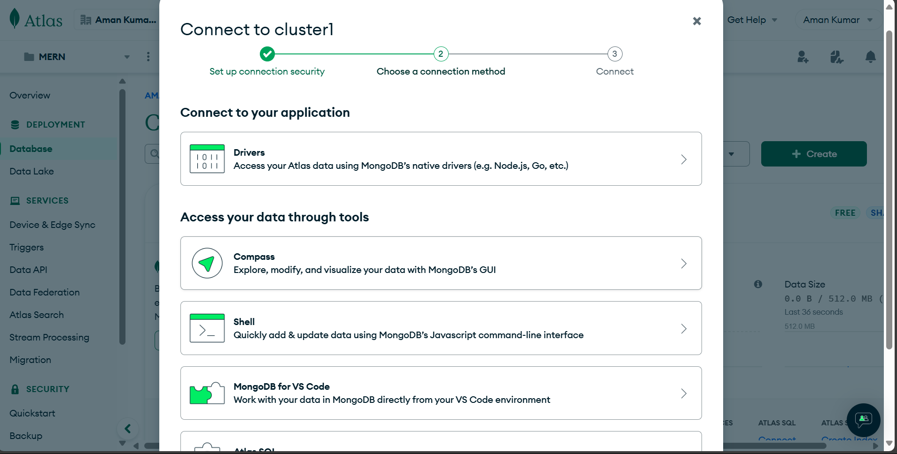

   - Get the connection string, which will look something like this:

   ```
   mongodb+srv://<username>:<password>@<cluster_name>.mongodb.net
   ```

   - 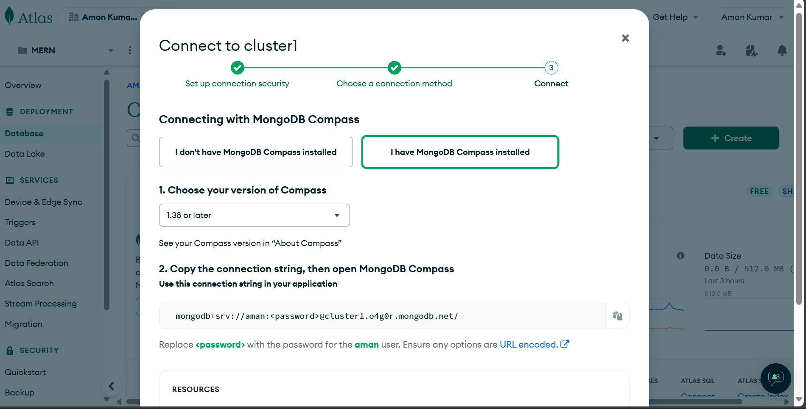

### Step 3: Set Up Environment Variables

Create a `.env` file in the root directory of the `backend` folder and add the following content:

```bash
PORT=3000
MONGO_URI=mongodb+srv://<username>:<password>@<cluster_name>.mongodb.net
```

Replace `<username>`, `<password>`, and `<cluster_name>` with the actual values from your MongoDB Atlas connection string.

### Step 4: Create a Database Utility File

To manage the MongoDB connection, create a new folder named `utils` in the `backend` directory and inside it, create a file named `db.js` with the following code:

```js
const mongoose = require("mongoose");

const URI = process.env.MONGO_URI;

const connectDB = async () => {
  if (!URI) {
    console.error("MongoDB URI is not defined");
    process.exit(1); // Exit if URI is not set
  }

  try {
    const conn = await mongoose.connect(URI, {
      dbName: "mern", // Replace with your actual database name
    });
    console.log("MongoDB Database Connected Successfully");
  } catch (error) {
    console.error(`Error: ${error.message}`);
    process.exit(1);
  }
};

module.exports = connectDB;
```

This utility file will handle the connection to the MongoDB database.

### Step 5: Integrate MongoDB Connection into the Server

Now, modify your `index.js` file to use the `connectDB` function for connecting to MongoDB before starting the server:

```js
require("dotenv").config();
const express = require("express");
const app = express();
const router = require("./router/auth-router");
const connectDB = require("./utils/db");

// Middleware
app.use(express.json());
app.use("/api/auth", router);

app.get("/", (req, res) => {
  res.send("Hello World");
});

// Connect to the database and start the server
connectDB()
  .then(() => {
    const PORT = process.env.PORT || 3000;
    app.listen(PORT, () => {
      console.log(`Server is running on port ${PORT}`);
    });
    console.log("Database connected");
  })
  .catch((err) => {
    console.error("Database connection failed", err);
    process.exit(1);
  });
```

## Day 5 - User Model and Schema

### Understanding Schema and Model:

- **Schema**:
  - Defines the structure of the documents within a MongoDB collection.
  - Specifies the fields, their types, and additional constraints or validation rules.
- **Model**:
  - A higher-level abstraction that interacts with the database based on the defined schema.
  - Represents a collection and provides an interface for querying, creating, updating, and deleting documents in that collection.
  - Models are created from schemas and enable you to work with MongoDB data in a more structured manner in your application.

### Steps:

1. **Create the `model` Folder**:

   - In the `backend` directory, create a new folder named `model`.

2. **Create the `user-model.js` File**:
   - Inside the `model` folder, create a file named `user-model.js`.
   - Define the `userSchema` and `User` model as follows:

```js
const mongoose = require("mongoose");

const userSchema = new mongoose.Schema({
  username: {
    type: String,
    required: true,
  },
  email: {
    type: String,
    required: true,
    unique: true,
  },
  phone: {
    type: Number,
    required: true,
  },
  password: {
    type: String,
    required: true,
  },
  isAdmin: {
    type: Boolean,
    default: false,
  },
});

const User = mongoose.model("User", userSchema);
module.exports = User;
```

### Explanation:

- **Fields**:
  - `username`, `email`, `phone`, and `password` are required fields.
  - `email` is also unique, meaning no two users can have the same email address.
  - `isAdmin` is a boolean field with a default value of `false`, indicating whether the user has admin privileges.

## Day 6 - Storing Registered User Data in MongoDB Using Postman

In this step, we will update our `auth-controller.js` to store registered user data in the MongoDB database. We'll validate the input data, check if the user already exists, and then create a new user record if everything is valid.

### Step 1: Update `auth-controller.js`

Make the following changes to your `auth-controller.js`:

```js
const User = require("../models/user-model");

const home = async (req, res) => {
  try {
    res.send("Welcome to the home page using controller");
  } catch (error) {
    console.error(error);
  }
};

const register = async (req, res) => {
  try {
    console.log(req.body);

    const { username, email, phone, password } = req.body;

    // Check if any field is empty
    if (!username || !email || !phone || !password) {
      return res.status(400).json({ message: "Please fill all the fields" });
    }

    // Check if the user already exists (email)
    const userExists = await User.findOne({ email });
    if (userExists) {
      return res.status(400).json({ message: "User already exists" });
    }

    // Create a new user
    const user = await User.create({
      username,
      email,
      phone,
      password,
    });

    res.status(201).json({ message: "User registered successfully", user });
    console.log(user);
  } catch (error) {
    console.error(error);
    res.status(500).json({ message: "Server error. Please try again later." });
  }
};

module.exports = { home, register };
```

### Explanation:

1. **Field Validation**: The code first checks if all required fields (`username`, `email`, `phone`, and `password`) are provided. If any field is missing, it returns a `400 Bad Request` response with a message indicating that all fields must be filled.

2. **User Existence Check**: It then checks if a user with the same email already exists in the database. If the user is found, it returns a `400 Bad Request` response with a message indicating that the user already exists.

3. **User Creation**: If the user does not exist, the code creates a new user document in the database with the provided data and returns a `201 Created` response, indicating that the user was successfully registered.

4. **Error Handling**: Any errors during the process are caught, logged, and a `500 Internal Server Error` response is sent to the client.

### Step 2: Test the Registration Endpoint Using Postman

Now, you can test the registration functionality using Postman:

1. **Open Postman**:

   - Set the request type to `POST`.
   - Enter the URL: `http://localhost:3000/api/auth/register`.

2. **Headers**:

   - Ensure the `Content-Type` header is set to `application/json`.

3. **Body**:

   - Select `raw` and choose `JSON` from the dropdown.
   - Enter the following JSON data in the body:
     ```json
     {
       "username": "aman",
       "email": "amankrsinha07@gmail.com",
       "phone": "9876543210",
       "password": "12345"
     }
     ```

4. **Send the Request**:
   - Click `Send` to register the new user.
   - If successful, you should see a response with the message "User registered successfully" and the user data.

#### Screenshot References:

- **Register Using Postman**:

  - 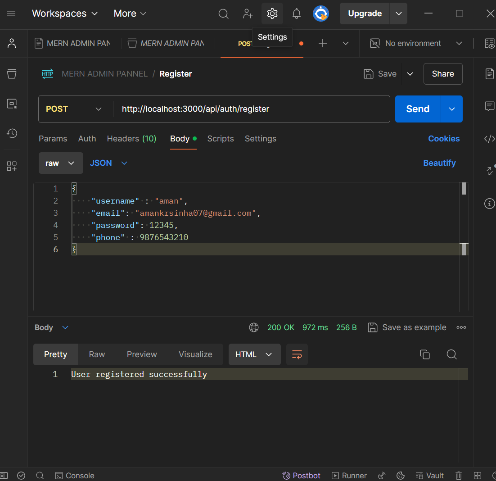

- **User Data in MongoDB Atlas**:

  - 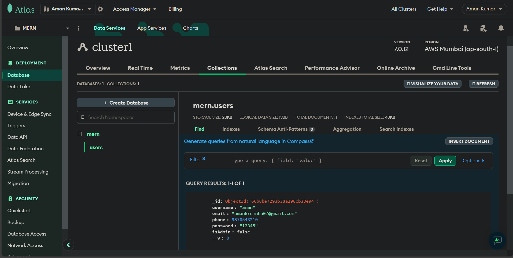

- **User Data in MongoDB Compass**:
  - 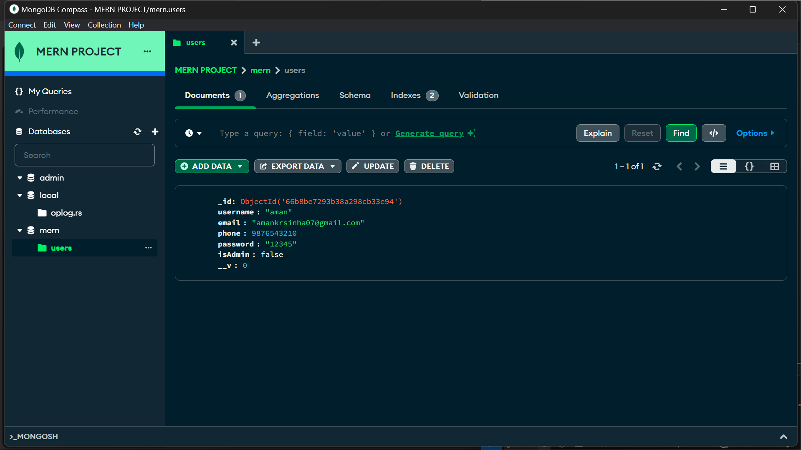

### Conclusion:

By following these steps, you've successfully implemented a feature to store registered user data in MongoDB. You've also learned how to validate input data, check for existing users, and handle errors, all while testing the functionality using Postman.

This is a crucial step in building your MERN stack application, as user registration is often the first interaction users have with your backend system.

## Day 7 - Secure User Password Using Bcrypt.js

To enhance the security of your application, it is crucial to hash passwords before storing them in the database. This ensures that even if your database is compromised, the stored passwords remain secure.

### Step 1: Install Bcrypt.js

First, you'll need to install the `bcryptjs` package, which will help you hash passwords.

```bash
npm i bcryptjs
```

### Step 2: Update `auth-controller.js`

Now, modify your `auth-controller.js` to hash the user's password before saving it to the database:

```js
const bcrypt = require("bcryptjs");

// Hashing the password before creating user
const saltRounds = 10;
const hashedPassword = await bcrypt.hash(String(password), saltRounds);

// Create a new user with the hashed password
const user = await User.create({
  username,
  email,
  phone,
  password: hashedPassword,
});
```

### Explanation:

1. **Bcrypt.js Import**: We first import `bcryptjs` to use its hashing functionality.

2. **Salt Rounds**: The `saltRounds` variable defines the cost factor, which is the number of times the hashing algorithm will be applied. A higher number increases the computation time, making it harder for attackers to crack the password.

3. **Hashing the Password**:

   - The `bcrypt.hash()` method takes two arguments: the password to hash and the number of salt rounds.
   - The `String(password)` ensures that the password is converted to a string before hashing.
   - The hashed password is then stored in the `hashedPassword` variable.

4. **Creating the User**:
   - Instead of storing the plain password, we store the `hashedPassword` in the database when creating a new user.

### Step 3: Testing the Hashed Password

After implementing the changes, you can test the registration functionality again using Postman, as you did in Day 6. This time, when you check the user data in MongoDB Atlas or Compass, you should see the password field containing a hashed value instead of the plain text password.

#### Screenshot Reference:

- **Hashed Password in Database**:
  - 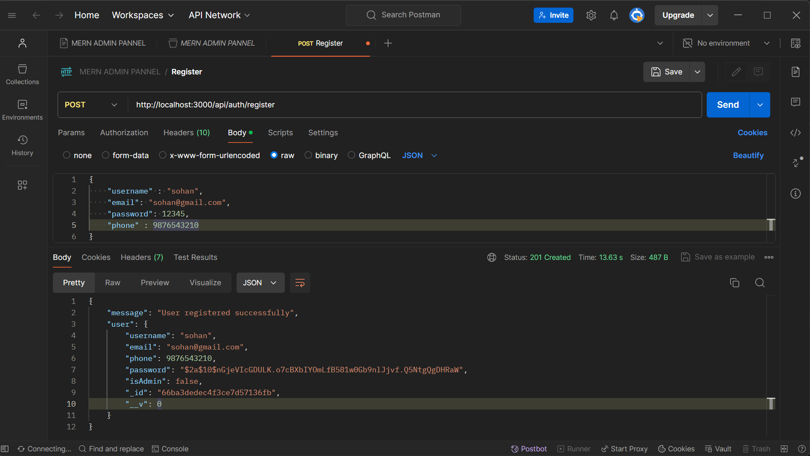

### Conclusion:

By hashing passwords before storing them, you've taken an essential step toward securing user data in your application. Bcrypt.js is a widely-used and trusted library for password hashing, making it an excellent choice for this task.

## Day 8 - Secure User Authentication with JSON Web Token (JWT)

JSON Web Tokens (JWT) are an open standard (RFC 7519) that defines a compact and self-contained way of securely transmitting information between parties as a JSON object. JWTs are widely used for authentication and authorization in web applications.

### Why Use JWT?

1. **Authentication**: JWTs help verify the identity of a user or a client.
2. **Authorization**: JWTs determine what actions a user or client is allowed to perform.

### Components of a JWT

- **Header**: Contains metadata about the token, such as the type of token and the signing algorithm being used.
- **Payload**: Contains claims or statements about an entity (typically the user) and additional data. Common claims include user ID, username, and expiration time.
- **Signature**: Ensures that the sender of the JWT is who they claim to be and that the message has not been altered.

### Important Note:

Tokens like JWTs are typically not stored in the database along with other user details. Instead, they are issued by the server during the authentication process and then stored on the client side (e.g., in cookies or local storage) for later use.

### Step 1: Install JWT

To start using JWT, install the `jsonwebtoken` package:

```bash
npm i jsonwebtoken
```

### Step 2: Modify `auth-controller.js` to Generate JWT

Now, update the `auth-controller.js` file to generate and send a JWT when a user registers:

```js
const User = require("../models/user-model");
const bcrypt = require("bcryptjs");

const register = async (req, res) => {
  try {
    const { username, email, phone, password } = req.body;

    if (!username || !email || !phone || !password) {
      return res.status(400).json({ message: "Please fill all the fields" });
    }

    const userExists = await User.findOne({ email: email });
    if (userExists) {
      return res.status(400).json({ message: "User already exists" });
    }

    const saltRounds = 10;
    const hashedPassword = await bcrypt.hash(String(password), saltRounds);

    // Create a new user
    const user = await User.create({
      username,
      email,
      phone,
      password: hashedPassword,
    });

    // Generate JWT Token
    const token = await user.generateToken();

    res.status(201).json({
      message: "User registered successfully",
      createdUser: user,
      token: token,
      userId: user._id.toString(),
    });
  } catch (error) {
    console.error(error);
    res.status(500).json({ message: "Server error" });
  }
};

module.exports = { register };
```

### Step 3: Add `generateToken` Method in `user-model.js`

Next, head over to `user-model.js` and add a method to generate a JWT:

```js
const mongoose = require("mongoose");
const jwt = require("jsonwebtoken");

const userSchema = new mongoose.Schema({
  username: { type: String, required: true },
  email: { type: String, required: true, unique: true },
  phone: { type: Number, required: true },
  password: { type: String, required: true },
  isAdmin: { type: Boolean, default: false },
});

userSchema.methods.generateToken = function () {
  try {
    const token = jwt.sign(
      { _id: this._id, email: this.email, isAdmin: this.isAdmin },
      process.env.JWT_SECRET,
      { expiresIn: "7d" }
    );
    return token;
  } catch (error) {
    console.error(error);
    return null;
  }
};

const User = mongoose.model("User", userSchema);
module.exports = User;
```

### Step 4: Add JWT Secret Key to `.env` File

Finally, add your JWT secret key to your `.env` file:

```bash
JWT_SECRET=your_secret_key
```

Note : A **secret key** is a unique string used to sign and verify JWTs, ensuring their authenticity and integrity. It protects against unauthorized access by allowing the server to confirm that the token hasn't been tampered with.

### Step 5: Testing JWT in Postman

After these changes, you can register a user via Postman. The response should include a JWT token, which you can use for authentication in future requests.

#### Screenshot Reference:

- **JWT Token in Postman**:
  - 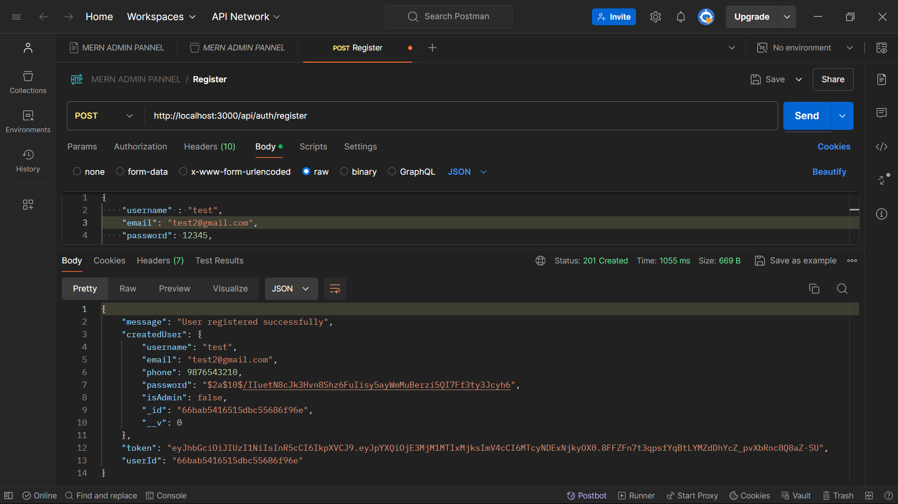

### Conclusion:

By using JSON Web Tokens (JWT), you've added an extra layer of security to your user authentication process. JWTs are an effective and scalable solution for managing user sessions in modern web applications.


## Day 9 - User Login Route

To implement user login functionality, add the following route in `auth-router.js`:

```js
router.route("/login").post(login);
```

In `auth-controller.js`, define the `login` function:

```js
const login = async (req, res) => {
  try {
    const { email, password } = req.body;

    // Check if any field is empty
    if (!email || !password) {
      return res.status(400).json({ message: "Please fill all the fields" });
    }

    // Check if the user exists
    const user = await User.findOne({ email });
    if (!user) {
      return res.status(400).json({ message: "Invalid Credentials" });
    }

    // Compare the password
    const isPasswordValid = await bcrypt.compare(String(password), user.password);
    if (!isPasswordValid) {
      return res.status(401).json({ message: "Username or Password is Incorrect" });
    }

    // Successful login, return JWT
    res.status(200).json({
      message: "User logged in successfully",
      token: await user.generateToken(),
      userId: user._id.toString(),
    });
  } catch (error) {
    console.error(error);
    res.status(500).json({ message: "Server error. Please try again later." });
  }
};

module.exports = { home, register, login };
```

### Screenshot of the Login Route in Postman
- 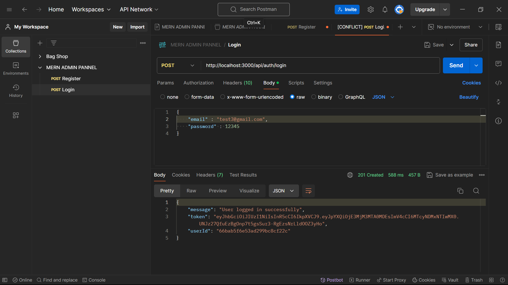


## Day 10 - Validation using Zod

Today, we’re focusing on implementing validation using **Zod**, a TypeScript-first schema declaration and validation library. Zod is designed to provide an easy-to-use and powerful way to validate data in JavaScript and TypeScript projects. It allows you to define schemas for your data and validate them with a simple API.

### What is Zod?

Zod is a schema validation library that provides a type-safe way to validate and parse data. It supports a wide range of validation features, including string, number, array, object validation, and more. Zod is particularly useful when you want to ensure that data conforms to a specific structure or set of rules, making it ideal for validating request bodies, query parameters, and other inputs in your applications.

### How Zod Works

1. **Define Schemas**: You define schemas that describe the expected shape and constraints of your data.
2. **Parse and Validate**: You use these schemas to parse and validate incoming data. If the data does not meet the schema’s requirements, Zod throws a detailed error.
3. **Handle Errors**: You catch and handle validation errors to provide meaningful feedback to users.

### Steps to Implement Validation

#### 1. Install Zod

First, install Zod in your project:

```bash
npm i zod
```

#### 2. Create Validator Schema

Create a folder named `validator` in the backend directory. Inside this folder, create a file named `auth-validator.js` with the following content:

```js
const { z } = require('zod');

const SignUpSchema = z.object({
    username: z
        .string({ required_error: "Username is required" })
        .trim()
        .min(3, { message: "Username must be at least 3 characters long" })
        .max(255, { message: "Username must be at most 255 characters long" }),

    email: z
        .string({ required_error: "Email is required" })
        .trim()
        .min(3, { message: "Email must be at least 3 characters long" })
        .max(255, { message: "Email must be at most 255 characters long" })
        .email({ message: "Invalid email address", tldWhitelist: ["com", "net"] }),

    phone: z
        .string({ required_error: "Phone is required" })
        .trim()
        .min(10, { message: "Phone must be at least 10 characters long" })
        .max(15, { message: "Phone must be at most 15 characters long" })
        .regex(/^\d+$/, { message: "Phone must contain only digits" }),

    password: z
        .string({ required_error: "Password is required" })
        .min(6, { message: "Password must be at least 6 characters long" })
        .max(255, { message: "Password must be at most 255 characters long" }),
});

module.exports = { SignUpSchema };
```

#### 3. Create Validation Middleware

Create a folder named `middlewares` and add a file named `validate-middleware.js`:

```js
const validate = (Schema) => async (req, res, next) => {
    try {
        const parsedBody = Schema.parse(req.body); // Validate the request body
        req.body = parsedBody; // Overwrite the request body with the parsed data
        next(); // Move to the next middleware or route handler
    } catch (error) {
        res.status(400).json({
            message: "Validation Failed",
            errors: error.errors // Detailed errors from Zod
        });
    }
};

module.exports = validate;
```

#### 4. Update Routes

Integrate the validation middleware into your routes. Open `auth-router.js` and update it as follows:

```js
const express = require('express');
const router = express.Router();
const { home, register, login } = require('../controllers/auth-controller');
const { SignUpSchema } = require('../validators/auth-validator');
const validate = require('../middlewares/validate-middleware');

router.route('/')
    .get(home);

router.route('/register')
    .post(validate(SignUpSchema), register); // Add validation middleware here

router.route('/login')
    .post(login);

module.exports = router;
```

#### Zod Validation Errors in Postman

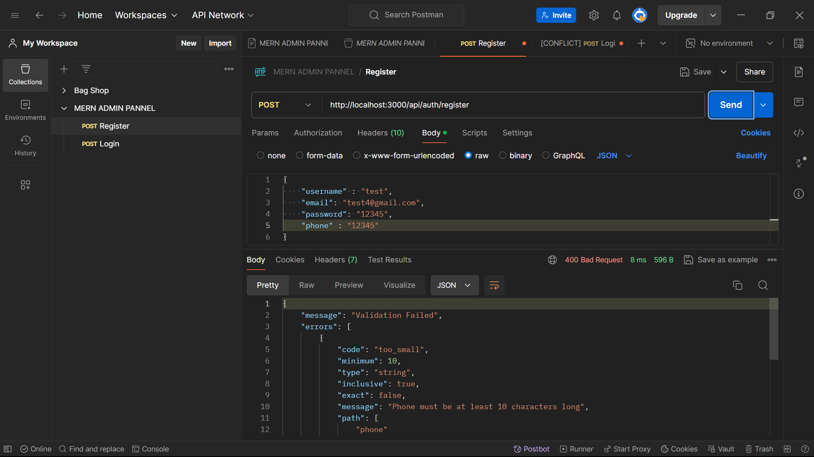

### Summary

By following these steps, you’ve integrated Zod validation into your Express application. This setup ensures that incoming data is validated according to the defined schema, providing robust error handling and improving data integrity in your application.

## Day 11 - Express Error Handling Middleware

Today’s focus was on implementing centralized error handling in an Express.js application using a custom error middleware. This approach allows you to manage all errors from a single place, enhancing code maintainability and readability.

### Key Concepts

- **Error Middleware:** A special type of middleware in Express that handles errors thrown in the application, simplifying error management.
- **Centralized Error Handling:** Allows catching and responding to errors from a single location, improving maintainability.

### Implementation Steps

1. **Create the Error Middleware:**

   In the `middlewares` folder, create a file named `error-middleware.js`:

   ```js
   const errorMiddleware = (err, req, res, next) => {
       const status = err.status || 500;
       const message = err.message || "Something went wrong. Server error. Please try again later.";
       res.status(status).json({ message });
   };

   module.exports = errorMiddleware;
   ```

2. **Modify Your Controllers:**

   Replace `catch` blocks with `next(error)` to delegate error handling to the middleware. For example, in `auth-controller.js`:

   ```js
   const register = async (req, res, next) => {
       try {
           const { username, email, phone, password } = req.body;

           if (!username || !email || !phone || !password) {
               return res.status(400).json({ message: "Please fill all the fields" });
           }

           const userExists = await User.findOne({ email });
           if (userExists) {
               return res.status(400).json({ message: "User already exists" });
           }

           const saltRound = 10;
           const hashedPassword = await bcrypt.hash(String(password), saltRound);

           const user = await User.create({
               username,
               email,
               phone,
               password: hashedPassword
           });

           res.status(201).json({
               message: "User registered successfully",
               createdUser: user,
               token: await user.generateToken(),
               userId: user._id.toString(),
           });
       } catch (error) {
           next(error); // Pass the error to the middleware
       }
   };
   ```

3. **Update the Validate Middleware:**

   Update the validation middleware to send errors to the error middleware:

   ```js
   const validate = (Schema) => async (req, res, next) => {
       try {
           const parsedBody = Schema.parse(req.body);
           req.body = parsedBody;
           next();
       } catch (error) {
           next({
               status: 400,
               message: error.errors
           });
       }
   };

   module.exports = validate;
   ```

4. **Integrate the Middleware:**

   Finally, make sure to include the error middleware in `index.js`:

   ```js
   require('dotenv').config();
   const express = require('express');
   const app = express();
   const router = require('./router/auth-router');
   const connectDB = require('./utils/db');
   const errorMiddleware = require('./middlewares/error-middleware');

   app.use(express.json());
   app.use('/api/auth', router);

   app.get('/', (req, res) => {
       res.send('Hello World');
   });

   app.use(errorMiddleware); // This must be just above the connection

   connectDB()
       .then(() => {
           const PORT = process.env.PORT || 3000;
           app.listen(PORT, () => {
               console.log(`Server is running on port ${PORT}`);
           });
       })
       .catch((err) => {
           console.error('Database connection failed', err);
           process.exit(1);
       });
   ```

### Summary

By setting up a centralized error handling middleware in Express, you can efficiently manage errors across your application, improving the reliability and readability of your code.


## Day 12 - Contact Form (Schema, Route & Logics)

Today’s focus was on implementing a contact form in an Express.js application. This included creating a Mongoose schema, setting up routes, and defining the logic for handling form submissions.

### Key Concepts

- **Mongoose Schema:** Defines the structure of the data for MongoDB.
- **Express Routes:** Handles incoming requests and integrates with controllers.
- **Error Handling:** Manages and logs errors during form submission.

### Implementation Steps

#### 1. Define the Mongoose Schema

Create a schema for the contact form data in `models/contact-form-model.js`:

```js
const mongoose = require('mongoose');

const contactFormSchema = new mongoose.Schema({
    email: {
        type: String,
        required: true,
    },
    subject: {
        type: String,
        required: true,
    },
    message: {
        type: String,
        required: true
    },
});

const ContactForm = mongoose.model('ContactForm', contactFormSchema);
module.exports = ContactForm;
```

**Note:** Ensure that the `email` field is not unique if you want to allow multiple submissions with the same email address.

#### 2. Create the Contact Form Controller

Implement the logic to handle form submissions in `controllers/contact-controller.js`:

```js
const Contact = require('../models/contact-form-model');

const contactForm = async (req, res, next) => {
    try {
        console.log(req.body);

        const { email, subject, message } = req.body;

        // Check if any field is empty
        if (!email || !subject || !message) {
            return res.status(400).json({ message: "Please fill all the fields" });
        }

        // Create a new form data
        const contactData = await Contact.create({
            email,
            subject,
            message
        });

        res.status(201).json({
            message: "Form Submitted Successfully",
            formData: contactData,
        });

        console.log(contactData);

    } catch (error) {
        console.error(error);
        next(error); // Pass the error to the middleware
    }
};

module.exports = { contactForm };
```

#### 3. Set Up the Route

Define the route to handle contact form submissions in `router/contact-router.js`:

```js
const express = require('express');
const router = express.Router();
const { contactForm } = require('../controllers/contact-controller');
const { ContactFormSchema } = require('../validators/contact-form-validator');
const validate = require('../middlewares/validate-middleware');

router.route('/contact')
    .post(validate(ContactFormSchema), contactForm); // Middleware to validate the request body

module.exports = router;
```

#### 4. Create Validation Schema

Implement the validation logic for the contact form data in `validators/contact-form-validator.js`:

```js
const { z } = require('zod');

const ContactFormSchema = z.object({
    email: z
        .string({ required_error: "Email is required" })
        .trim()
        .min(3, { message: "Email must be at least 3 characters long" })
        .max(255, { message: "Email must be at most 255 characters long" })
        .email({ message: "Invalid email address", tldWhitelist: ["com", "net"] }),

    subject: z
        .string({ required_error: "Subject is required" })
        .trim()
        .min(3, { message: "Subject must be at least 3 characters long" })
        .max(255, { message: "Subject must be at most 255 characters long" }),

    message: z
        .string({ required_error: "Message is required" })
        .trim()
        .min(3, { message: "Message must be at least 3 characters long" })
        .max(255, { message: "Message must be at most 255 characters long" }),
});

module.exports = { ContactFormSchema };
```

#### 5. Update Main Application File

Ensure the contact route is integrated into your main application file `index.js`:

```js
require('dotenv').config();
const express = require('express');
const app = express();
const authRoute = require('./router/auth-router');
const contactRoute = require('./router/contact-router');
const connectDB = require('./utils/db');
const errorMiddleware = require('./middlewares/error-middleware');

// Middleware
app.use(express.json());
app.use('/api/auth', authRoute);
app.use('/api/form', contactRoute);

app.get('/', (req, res) => {
    res.send('Hello World');
});

app.use(errorMiddleware); // This must be just above the connection

// Connect to the database and start the server
connectDB()
    .then(() => {
        const PORT = process.env.PORT || 3000;
        app.listen(PORT, () => {
            console.log(`Server is running on port ${PORT}`);
        });
    })
    .catch((err) => {
        console.error('Database connection failed', err);
        process.exit(1);
    });
```

### Testing

To test the contact form, use Postman to send a POST request to `http://localhost:3000/api/form/contact` with the following JSON body:

```json
{
    "email": "example@example.com",
    "subject": "Test Subject",
    "message": "This is a test message."
}
```

- For visual reference, check the screenshots provided:

- 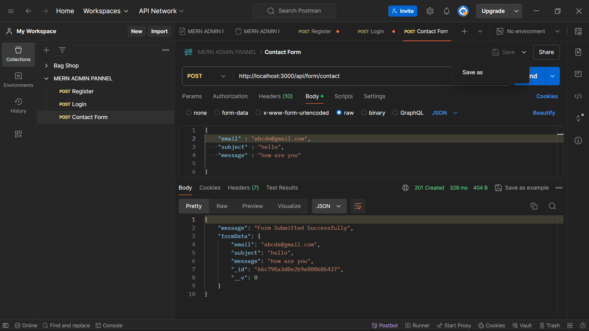


### Summary

In this setup, we created a contact form feature that includes a Mongoose schema, an Express route, and validation logic. The contact form allows users to submit their email, subject, and message, and the data is stored in MongoDB.

This centralized approach to handling form submissions, including validation and error management, helps maintain clean and organized code.


## Day 13 - Installing ReactJS

### Step 1: Set Up the ReactJS Project

1. **Navigate to the frontend directory**:
    ```bash
    cd frontend
    ```

2. **Create a new React project using Vite**:
    ```bash
    npm create vite@latest .
    ```

3. **Configuration**:
    - Select a framework: **React**
    - Select a variant: **JavaScript**

4. **Install dependencies and start the development server**:
    ```bash
    npm install
    npm run dev
    ```

### Step 2: Install and Configure Tailwind CSS

1. **Install Tailwind CSS and its dependencies**:
    ```bash
    npm install -D tailwindcss postcss autoprefixer
    npx tailwindcss init -p
    ```

2. **Configure Tailwind in `tailwind.config.js`**:
    ```js
    /** @type {import('tailwindcss').Config} */
    export default {
      content: [
        "./index.html",
        "./src/**/*.{js,ts,jsx,tsx}",
      ],
      theme: {
        extend: {},
      },
      plugins: [],
    }
    ```

3. **Update `index.css` to use Tailwind’s base, components, and utilities**:
    ```css
    @tailwind base;
    @tailwind components;
    @tailwind utilities;
    ```

### Step 3: Test Tailwind CSS Installation

1. **Update `App.jsx` to include a test component**:
    ```jsx
    import "./App.css";

    const App = () => {
      return (
        <>
          <h1 className="text-3xl font-bold underline">Hello world!</h1>
        </>
      );
    };

    export default App;
    ```

2. **Run the development server to verify the setup**:
    ```bash
    npm run dev
    ```

After following these steps, you should see "Hello world!" styled with Tailwind CSS on your browser, indicating that your ReactJS environment is successfully set up.


## Day 14 - Page Navigation with React Router DOM

Today, we're learning how to create a multi-page application in React using **React Router DOM**. This will allow us to navigate between different pages without reloading the browser.

### What You’ll Learn
- **React Router DOM basics**: How to set up and use React Router for page navigation.
- **Creating a simple layout**: Adding a Header, Footer, and dynamic content area.
- **Routing in React**: Displaying different components based on the URL path.

Let’s break it down step by step!

### Step 1: Installing React Router DOM

First, we need to install `react-router-dom`, a package that handles routing in React applications.

#### Installation Command
Open your terminal and run:

```bash
npm install react-router-dom
```

This command installs the necessary library, enabling us to set up navigation between different pages in our React app.

### Step 2: Creating Page Components

We'll create three simple pages: Home, About, and Contact. These will be the different pages that users can navigate to.

#### Folder Structure
1. Inside the `src` directory, create a new folder named `pages`.
2. In the `pages` folder, create three files: `Home.jsx`, `About.jsx`, and `Contact.jsx`.

#### Writing Page Components

**Home.jsx:**

```jsx
const Home = () => {
  return (
    <div>
      <h1 className="m-3">Home Page</h1>
    </div>
  );
};

export default Home;
```

**About.jsx:**

```jsx
const About = () => {
  return (
    <div>
      <h1 className="m-3">About Page</h1>
    </div>
  );
};

export default About;
```

**Contact.jsx:**

```jsx
const Contact = () => {
  return (
    <div>
      <h1 className="m-3">Contact Page</h1>
    </div>
  );
};

export default Contact;
```

#### Explanation:
- Each file contains a simple functional component. A functional component is just a JavaScript function that returns some JSX (HTML-like syntax).
- We’re keeping the pages simple with just a heading for now. The goal is to understand routing.

### Step 3: Creating Header and Footer Components

Now, let’s create a navigation menu (Header) and a Footer that will appear on every page.

#### Folder Structure
1. Inside the `src` directory, create another folder named `components`.
2. In the `components` folder, create two files: `Header.jsx` and `Footer.jsx`.

#### Writing Header and Footer Components

**Header.jsx:**

```jsx
// Importing NavLink from React Router to create navigation links
import { NavLink } from "react-router-dom";

const Header = () => {
  return (
    <header className="w-full">
      <nav className="bg-white text-lg">
        
        <ul className="flex font-medium">
          <li className="m-3">
            <NavLink
              to="/"
              className={({ isActive }) =>
                `py-2 ${isActive ? "text-orange-700" : "text-gray-700"}`
              }
            >
              Home
            </NavLink>
          </li>
          <li className="m-3">
            <NavLink
              to="/about"
              className={({ isActive }) =>
                `py-2 ${isActive ? "text-orange-700" : "text-gray-700"}`
              }
            >
              About
            </NavLink>
          </li>
          <li className="m-3">
            <NavLink
              to="/contact"
              className={({ isActive }) =>
                `py-2 ${isActive ? "text-orange-700" : "text-gray-700"}`
              }
            >
              Contact
            </NavLink>
          </li>
        </ul>
      </nav>
    </header>
  );
};

export default Header;
```

#### Explanation:
- **NavLink:** This component works like an anchor (`<a>`) tag but with additional features from React Router. It helps you create navigation links that are aware of the active route.
- **Dynamic Styling:** The function inside `className` checks if the link is active. If it is, the link text turns orange; otherwise, it remains gray.

**Footer.jsx:**

```jsx
const Footer = () => {
  return (
    <div className="m-3">
      Footer
    </div>
  );
};

export default Footer;
```

The `Footer.jsx` component is simple and straightforward, just displaying a footer message.

### Step 4: Setting Up the Main Application Layout

The `App.jsx` file will act as our main layout. It will include the Header, Footer, and a dynamic content area where different pages will be displayed.

#### Updating `App.jsx`

Replace the existing content in `App.jsx` with the following:

```jsx
// Importing outlet
import { Outlet } from "react-router-dom";
import Header from "./components/Header";
import Footer from "./components/Footer";
import "./App.css";

const App = () => {
  return (
    <>
      {/* Header at the top of every page */}
      <Header />
      {/* Outlet to render the current page */}
      <Outlet />
      {/* Footer at the bottom of every page */}
      <Footer />
    </>
  );
};

export default App;
```

#### Explanation:
- **Header & Footer:** These components are included so they appear on every page.
- **Outlet:** This is a placeholder where the current page content (like Home, About, or Contact) will be displayed based on the active route.

### Step 5: Defining Routes in `main.jsx`

Now, let’s set up our routes to connect the URLs with the pages we’ve created.

#### Updating `main.jsx`

Replace the existing content in `main.jsx` with the following:

```jsx
import { StrictMode } from "react";
import { createRoot } from "react-dom/client";
import App from "./App.jsx";
import "./index.css";

// Import necessary modules 
import {
  Route,
  RouterProvider,
  createBrowserRouter,
  createRoutesFromElements,
} from "react-router-dom";

import Home from "./pages/Home.jsx";
import About from "./pages/About.jsx";
import Contact from "./pages/Contact.jsx";

// Define the routes for the application
const router = createBrowserRouter(
  createRoutesFromElements(
    <Route path="/" element={<App />}>
      {/* Home route */}
      <Route path="" element={<Home />} />
      {/* About route */}
      <Route path="/about" element={<About />} />
      {/* Contact route */}
      <Route path="/contact" element={<Contact />} />
    </Route>
  )
);

createRoot(document.getElementById("root")).render(
  <StrictMode>
    {/* Provide the router configuration to the application */}
    <RouterProvider router={router} />
  </StrictMode>
);
```

#### Explanation:
- **Route Configuration:** The `Route` component connects each URL path to a specific component. For example, when the user navigates to `/about`, the `About` component is displayed.
- **Nested Routes:** The `App` component serves as a parent route, so `Header` and `Footer` are always shown, and the `Outlet` dynamically loads the current page based on the route.

### Step 6: Testing the Application

Now that everything is set up, let’s test it out!

#### Running the Application
1. **Start the Development Server:**
    ```bash
    npm run dev
    ```
   This command starts the React development server.

2. **Open the Browser:**
   - Navigate to `http://localhost:3000/` in your web browser. You should see the Home page.

3. **Navigate Between Pages:**
   - Click on the "About" link in the Header to navigate to the About page.
   - Click on the "Contact" link to navigate to the Contact page.
   - Notice how the URL changes, but the page doesn’t reload—this is the magic of React Router!

### Recap & Conclusion

Well done! 🎉 You’ve successfully created a multi-page React application with seamless navigation. Here's a quick recap of what you learned today:
- **React Router DOM Basics:** You learned how to install and set up routing in a React app.
- **Creating a Layout:** You built a consistent layout with a Header and Footer across all pages.
- **Dynamic Navigation:** You used `NavLink` to highlight the current page and make navigation intuitive.

This knowledge is crucial for building real-world React applications. Keep experimenting with routing, and soon you'll be building even more dynamic and complex apps! 🚀

For more knowledge about React Router DOM, do checkout this repo : [React Router Crash Course](https://github.com/AmanKumarSinhaGitHub/React-Router-Crash-Course)

## Day 15 - Registration Form in React JS

In this lesson, we'll build a simple registration form in React JS and add navigation for the form. This tutorial will guide you step-by-step, making sure that even if you’re new to React, you’ll understand each part clearly.

### Step 1: Adding a NavLink for the Registration Page

We start by adding a new navigation link that points to our registration page. This will allow users to easily navigate to the registration form from the website's header.

#### Update `Header.jsx`

Add a new NavLink for the `/register` page:

```jsx
<NavLink
  to="/register"
  className={({ isActive }) =>
    `py-2 ${isActive ? "text-blue-400" : "text-gray-300"} hover:text-blue-400`
  }
>
  Register
</NavLink>
```

#### Explanation:
- **`NavLink` Component:** Used to create navigation links in React. The `to` prop specifies the URL path, and the `className` applies styles dynamically based on whether the link is active.
- **Dynamic Styling:** The `className` uses `isActive` to highlight the link when the user is on the corresponding page.

### Step 2: Adding a Route for the Registration Page

Next, we need to define a route for our new registration page so that React Router knows what to display when the user navigates to `/register`.

#### Update `main.jsx`

Add the route for the registration page:

```jsx
const router = createBrowserRouter(
  createRoutesFromElements(
    <Route path="/" element={<App />}>
      <Route path="" element={<Home />} />
      <Route path="/about" element={<About />} />
      <Route path="/contact" element={<Contact />} />
      <Route path="/register" element={<Register />} /> {/* Route for Register Page */}
    </Route>
  )
);
```

#### Explanation:
- **Route Setup:** We’re telling React Router to render the `Register` component when the user visits `/register`.

### Step 3: Creating the Registration Page Component

Let’s now create the registration page component. This component will contain a form where users can input their details like username, email, phone number, and password.

#### Create `Register.jsx`

Inside the `pages` folder, create a new file named `Register.jsx`:

```jsx
import { useState } from "react";

const Register = () => {
  // State to manage form data
  const [formData, setFormData] = useState({
    username: "",
    email: "",
    phone: "",
    password: "",
  });

  // Handle input changes
  const handleInput = (e) => {
    const name = e.target.name; // Name of the input field
    const value = e.target.value; // Value of the input field

    // Update the formData state
    setFormData({
      ...formData,
      [name]: value,
    });
  };

  // Handle form submission
  const handleSubmit = (e) => {
    e.preventDefault(); // Prevent default form submission behavior
    console.log("Form submitted:", formData);
    // Here we will write logic to store data in backend
  };

  return (
    <>
      <form onSubmit={handleSubmit}>
        <div>
          <label htmlFor="username">Username</label>
          <input
            type="text"
            name="username" // Field identifier
            id="username"
            value={formData.username} // State value
            onChange={handleInput} // Update value
            placeholder="Enter Username"
            required
          />
        </div>

        <div>
          <label htmlFor="email">Email</label>
          <input
            type="email"
            name="email"
            id="email"
            value={formData.email}
            onChange={handleInput}
            placeholder="Enter Email"
            required
          />
        </div>

        <div>
          <label htmlFor="phone">Phone</label>
          <input
            type="text"
            name="phone"
            id="phone"
            value={formData.phone}
            onChange={handleInput}
            placeholder="Enter Phone"
            required
          />
        </div>

        <div>
          <label htmlFor="password">Password</label>
          <input
            type="password"
            name="password"
            id="password"
            value={formData.password}
            onChange={handleInput}
            placeholder="Enter Password"
            required
          />
        </div>

        <div>
          <button type="submit">Register</button>
        </div>
      </form>
    </>
  );
};

export default Register;
```

#### Explanation:
- **State Management with `useState`:** We use the `useState` hook to manage the form data, including the username, email, phone number, and password.
- **Input Handling:** The `handleInput` function captures changes to the input fields and updates the state accordingly.
- **Form Submission:** The `handleSubmit` function prevents the default form submission behavior and logs the form data to the console. In a real application, you’d replace this with logic to send the data to a backend server.

### Step 4: Creating the Login Page and Contact Us Page (Do It Yourself)

You’ve successfully created a registration form! Now, as a challenge, try creating a login form on your own. Here’s what you need to do:
1. Add a NavLink for `/login` in `Header.jsx`.
2. Create a `Login.jsx` component with form fields for email and password.
3. Add a route for `/login` in `main.jsx`.

**Reference Design**
- 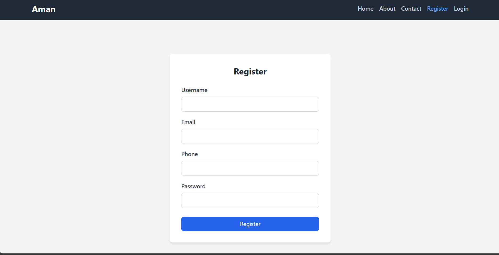
- 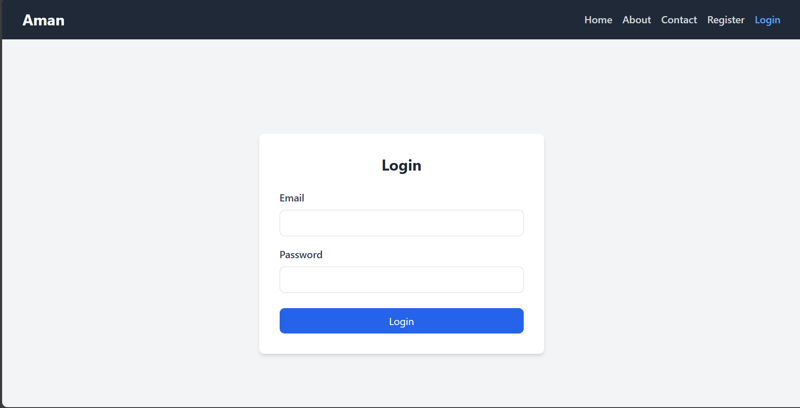


This guide should help you create a fully functional registration form with navigation. With React, once you understand the basic concepts like state management, routing, and component structure, you can build even more complex applications with ease!


## Day 16 - 404 Error Page (Page Not Found)

Today, we are going to implement a basic 404 error page in our React application. This page will be displayed whenever a user tries to access a route that doesn't exist.

### Step 1: Add the 404 Route in `main.jsx`

First, we need to handle routes that don't match any of our defined paths by adding a wildcard (`*`) route in `main.jsx`.

```jsx
import Error from "./pages/Error.jsx"; // Import the Error page

const router = createBrowserRouter(
  createRoutesFromElements(
    <Route path="/" element={<App />}>
      <Route path="" element={<Home />} />
      <Route path="/about" element={<About />} />
      <Route path="/contact" element={<Contact />} />
      <Route path="/register" element={<Register />} /> 
      <Route path="/login" element={<Login />} /> 
      <Route path="*" element={<Error/>} /> {/* Catch-all route for 404 */}
    </Route>
  )
);
```

### Step 2: Create the `Error.jsx` Component

Next, we'll create a simple `Error.jsx` component in the `pages` folder. This component will display a "404 Not Found" message and a link to return to the homepage.

```jsx
import { Link } from "react-router-dom";

const Error = () => {
  return (
    <>
      <h1>404 Not Found</h1>
      <p>Sorry, the page you're looking for doesn't exist.</p>
      <Link to="/">Go back to the main page</Link> {/* Link to redirect user to home */}
    </>
  );
};

export default Error;
```

### Explanation:

- **Wildcard Route (`*`)**: The `*` in the route path acts as a catch-all. Any path that doesn't match the defined routes will fall back to this route, triggering the `Error` component.

- **Error Component**: The `Error.jsx` file is a simple functional component that renders a message informing the user that the page was not found and includes a link to return to the homepage.

### Step 3: Test the 404 Page

Now, if you try to access a route in your application that doesn't exist (e.g., `http://localhost:3000/some-random-route`), the 404 error page will be displayed.

This setup ensures a smooth user experience by guiding users back to a valid part of your application if they land on an incorrect URL.


## Day 17 - Connect Frontend with Backend and Store Registration Data

On Day 17, we’ll connect our frontend (React) to the backend (Express.js) to store user registration data in MongoDB. We’ll cover setting up the connection, handling CORS errors, and successfully sending data from the frontend to the backend.

### Prerequisites

Ensure you have two terminals open in VS Code:

1. Start the frontend with `npm run dev`.
2. Start the backend with `nodemon index.js`.

### Overview

In the previous steps, we tested our backend using Postman to store data in MongoDB. Now, we’ll connect the frontend to the backend to handle the same functionality using a registration form in React.

### Step 0: Set Up Environment Variables

1. **Frontend `.env` File**: In the frontend folder, create a `.env` file to store the backend URL.

   ```bash
   VITE_BACKEND_URL=http://localhost:3000
   ```

2. **Backend `.env` File**: In the backend folder, update the `.env` file to include the frontend URL and other environment variables.

   ```bash
   PORT=3000
   MONGO_URI=mongodb+srv://<username>:<password>@cluster1.o4g0r.mongodb.net
   JWT_SECRET=amansecretkey
   VITE_FRONTEND_URL=http://localhost:5173
   ```

### Step 1: Modify `Register.jsx`

We’ll update the `handleSubmit` function in `Register.jsx` to send the registration data to our backend.

```jsx
import { useState } from "react";
import { useNavigate } from "react-router-dom";

const Register = () => {
  const [formData, setFormData] = useState({
    username: "",
    email: "",
    phone: "",
    password: "",
  });

  const handleChange = (e) => {
    const { name, value } = e.target;
    setFormData({
      ...formData,
      [name]: value,
    });
  };

  const navigate = useNavigate();

  const BACKEND_URL = import.meta.env.VITE_BACKEND_URL; // Getting the backend URL from the .env file 

  const handleSubmit = async (e) => {
    e.preventDefault();
    console.log("Form submitted:", formData);

    try {
      const response = await fetch(`${BACKEND_URL}/api/auth/register`, {
        method: "POST",
        headers: {
          "Content-Type": "application/json",
        },
        body: JSON.stringify(formData), // Convert JS object to JSON string
      });
      const data = await response.json();
      console.log(data);

      // Clearing the form after submission
      if (response.ok) {
        setFormData({
          username: "",
          email: "",
          phone: "",
          password: "",
        });

        alert('Registration successful');
        navigate('/login');
      } else {
        alert('Registration failed');
      }
    } catch (error) {
      console.error("Error:", error);
    }
  };

  return (
    <form onSubmit={handleSubmit}>
      <div>
        <label htmlFor="username">Username</label>
        <input
          type="text"
          name="username"
          id="username"
          value={formData.username}
          onChange={handleChange}
          placeholder="Enter Username"
          required
        />
      </div>

      <div>
        <label htmlFor="email">Email</label>
        <input
          type="email"
          name="email"
          id="email"
          value={formData.email}
          onChange={handleChange}
          placeholder="Enter Email"
          required
        />
      </div>

      <div>
        <label htmlFor="phone">Phone</label>
        <input
          type="text"
          name="phone"
          id="phone"
          value={formData.phone}
          onChange={handleChange}
          placeholder="Enter Phone"
          required
        />
      </div>

      <div>
        <label htmlFor="password">Password</label>
        <input
          type="password"
          name="password"
          id="password"
          value={formData.password}
          onChange={handleChange}
          placeholder="Enter Password"
          required
        />
      </div>

      <div>
        <button type="submit">Register</button>
      </div>
    </form>
  );
};

export default Register;
```

### Step 2: Handle CORS Errors

When connecting the frontend with the backend, you might encounter a **CORS Policy Error**. This occurs because web browsers restrict cross-origin HTTP requests.

#### Understanding CORS

CORS (Cross-Origin Resource Sharing) is a security feature that allows or restricts web pages from making requests to a different domain. In a MERN stack application, this issue arises when the frontend and backend are hosted on different domains.

### Step 3: Install and Configure CORS

To resolve the CORS issue, install the CORS package in the backend.

1. **Install CORS**: Ensure you're in the backend directory and run the following command:

   ```bash
   npm i cors
   ```

2. **Configure CORS in `index.js`**: Add the following code to your `index.js` file:

   ```js
   require('dotenv').config();
   const express = require('express');
   const cors = require('cors'); // Import cors
   const app = express();
   const authRoute = require('./router/auth-router');
   const contactRoute = require('./router/contact-router');
   const connectDB = require('./utils/db');
   const errorMiddleware = require('./middlewares/error-middleware');

   // CORS options for cross-origin requests
   const corsOptions = {
       origin: process.env.VITE_FRONTEND_URL, // Frontend URL from .env
       optionsSuccessStatus: 200, 
       methods: "GET,HEAD,PUT,PATCH,POST,DELETE", 
       credentials: true, 
   };

   app.use(cors(corsOptions)); // Use cors with defined options

   app.use(express.json());
   app.use('/api/auth', authRoute); // Auth routes
   app.use('/api/form', contactRoute); // Contact form routes

   app.get('/', (req, res) => {
       res.send('Hello World');
   });

   app.use(errorMiddleware); // Use error middleware

   // Connect to the database and start the server
   connectDB()
       .then(() => {
           const PORT = process.env.PORT || 3000;
           app.listen(PORT, () => {
               console.log(`Server is running on port ${PORT}`);
           });
       })
       .catch((err) => {
           console.error('Database connection failed', err);
           process.exit(1);
       });
   ```

### Step 4: Testing the Connection

After making the changes, you should be able to register users through the frontend. Here's what to expect:

1. **MERN Register Frontend Form**:
   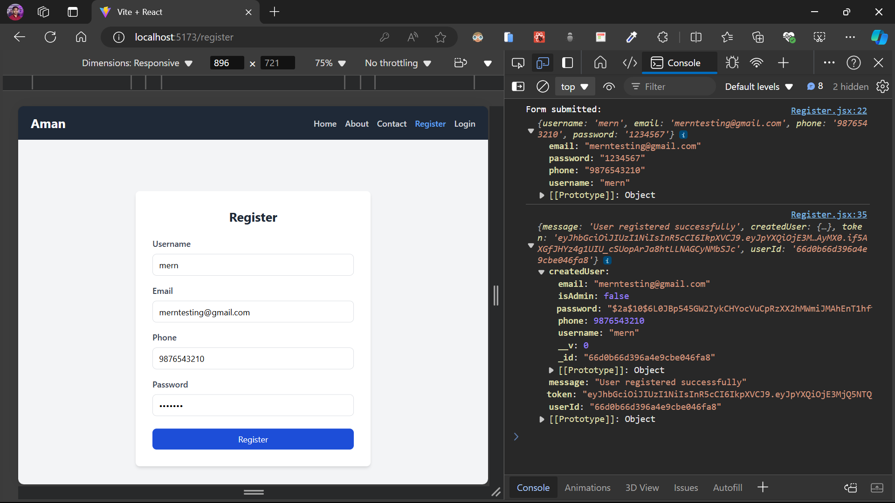

2. **Registered User in MongoDB Compass**:
   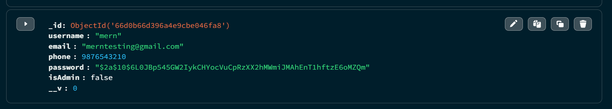

### Step 5: Add a Start Script to `package.json`

To streamline the process of starting your backend server, add a `start` script to the `package.json` file inside the backend folder.

#### Modify `package.json`

Open your `package.json` file in the backend folder and add the following `start` script under `"scripts"`:

```json
{
  "name": "backend",
  "version": "1.0.0",
  "description": "server",
  "main": "index.js",
  "scripts": {
    "start": "node index.js" // Add this line
  },
  "author": "aman",
  "license": "ISC",
  "dependencies": {
    "bcryptjs": "^2.4.3",
    "cors": "^2.8.5",
    "dotenv": "^16.4.5",
    "express": "^4.19.2",
    "jsonwebtoken": "^9.0.2",
    "mongodb": "^6.8.0",
    "mongoose": "^8.5.2",
    "zod": "^3.23.8"
  }
}
```

### Step 6: Run Your Backend

Now, you can start your backend server by running the following command:

```bash
npm start
```

This command will work in both development and production environments.

### Task: Store Contact Form Data in MongoDB

In addition to storing registration data, extend the functionality to store contact form data in MongoDB. Follow similar steps as you did for the registration form.

By the end of this task, you should be able to store both registration and contact form data in MongoDB from the frontend.


## Day 18 - Login Through Frontend

On Day 18, we'll add login functionality to the frontend using React and connect it to the backend for user authentication.

### Prerequisites

- Backend should be running (`nodemon index.js`).
- Frontend should be running (`npm run dev`).

### Step 1: Ensure Login Route is Set in `main.jsx`

Make sure the login route is added in `main.jsx`:

```jsx
<Route path="/login" element={<Login />} />
```

### Step 2: Implement Login Functionality in `Login.jsx`

Focus on the `handleSubmit` function to send the login request to the backend. Here's the essential code:

```jsx
import { useState } from "react";
import { useNavigate } from "react-router-dom";

const Login = () => {
  const [formData, setFormData] = useState({
    email: "",
    password: "",
  });

  const navigate = useNavigate();

  const handleInput = (e) => {
    const name = e.target.name;
    const value = e.target.value;

    setFormData({
      ...formData,
      [name]: value,
    });
  };

  const BACKEND_URL = import.meta.env.VITE_BACKEND_URL; // Getting the backend URL(localhost:3000) from the .env file 
  
  const handleSubmit = async (e) => {
    e.preventDefault();
    console.log("Form submitted:", formData);

    try {
      const response = await fetch(`${BACKEND_URL}/api/auth/login`, {
        method: 'POST',
        headers: {
          "Content-Type": "application/json"
        },
        body: JSON.stringify(formData)
      });

      const data = await response.json();
      console.log(data);

      if (response.ok) {
        setFormData({ email: "", password: "" });
        navigate('/');
      } else {
        alert('Login failed, please try again.');
      }
    } catch (error) {
      console.error('Error:', error);
    }
  };

  return (
    <form onSubmit={handleSubmit}>
      <div>
        <label htmlFor="email">Email</label>
        <input
          type="email"
          name="email"
          id="email"
          value={formData.email}
          onChange={handleInput}
          placeholder="Enter Email"
          required
        />
      </div>

      <div>
        <label htmlFor="password">Password</label>
        <input
          type="password"
          name="password"
          id="password"
          value={formData.password}
          onChange={handleInput}
          placeholder="Enter Password"
          required
        />
      </div>

      <button type="submit">Login</button>
    </form>
  );
};

export default Login;
```

### Step 3: Test the Login Functionality

- **Successful Login**: Redirects to the homepage.
- **Login Error**: Displays an alert to the user.

### CORS Issues (Handled)

If you encounter CORS issues, ensure CORS is set up in the backend (handled on Day 17).

### Backend Logic (Handled)

The backend logic for handling login requests is already implemented.

### Conclusion

You now have a functional login page that communicates with the backend to authenticate users.

## Day 19 - Store JWT Token in Local Storage using Context API for Authentication